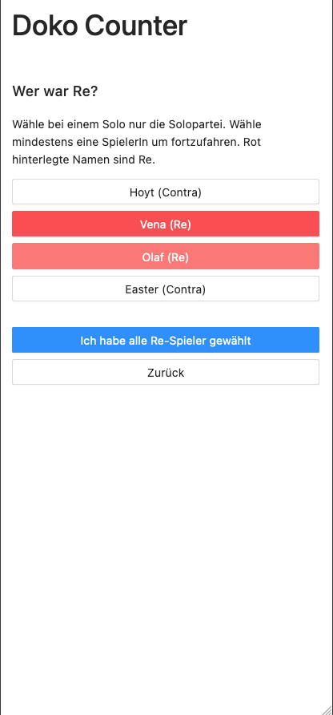

# doko-counter

An app to count points for the German card-game of Doppelkopf.



Made with https://github.com/sidestream-tech/sidebase/, which allows rapid proto-typing of nuxt 3 apps.

## Quick start

1. Install the dependencies
    ```sh
    npm i
    ```
2. Start developing (with database, backend, API, ... running) at [localhost:3000](http://localhost:3000)
    ```sh
    npm run dev
    ```

## Features

TBD, but hopefully:
- Have multiple different rounds + players,
- Playing timer,
- Statistics
